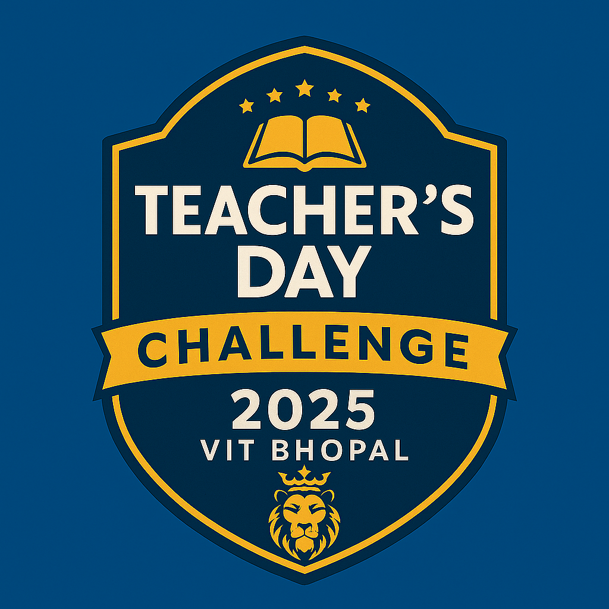

# 🎉 43-Day Teacher's Day Challenge 2025 — Completed!

<p align="center">
	
</p>


> *A tribute to every teacher, mentor, and guide who shaped my learning journey*

[](https://github.com/Premkolte/43-Days-Teachers-Day-Challenge-2025)
[](#)
[](#)

---

## � Challenge Completed!

🎉 **𝗖𝗼𝗺𝗽𝗹𝗲𝘁𝗲𝗱 𝘁𝗵𝗲 𝟰𝟯-𝗗𝗮𝘆 𝗧𝗲𝗮𝗰𝗵𝗲𝗿’𝘀 𝗗𝗮𝘆 𝗖𝗵𝗮𝗹𝗹𝗲𝗻𝗴𝗲 𝗼𝗻 𝗖𝗼𝗱𝗲𝗙𝗼𝗿𝗰𝗲𝘀!**

Over the past 43 days, I committed to solving at least one algorithmic challenge daily as part of the Teacher’s Day Challenge 2025 at VIT Bhopal. This journey was my way of honouring the spirit of continuous learning that our teachers inspire in us. �

**In total, I solved 100+ problems**, covering concepts across **Greedy, DP, Binary Search, Number Theory, Combinatorics, Simulation, and Implementation**. Each day was a step towards sharper logic and disciplined consistency. 💡

🏅 I’m grateful to have received the **Teacher’s Day Challenge 2025 Badge 🦁** — a symbol of persistence and growth.

Thank you to every teacher, mentor, and friend who inspired this journey! 🚀

---


## � About The Challenge

From July 25th to September 5th, 2025, I took on the 43-Day Teacher’s Day Challenge: solving at least one DSA or competitive programming problem every day, sharing handwritten solutions, and tracking my progress. This was my way to say thank you to all educators who made a difference in my life. 🙏


## 🎯 Challenge Goals

- �️ **Handwritten Solutions**: Detailed handwritten problem-solving approaches
- 💻 **Daily Coding**: Consistent problem-solving from core DSA and Codeforces topics
- � **Track Progress**: Documented 43 days of learning and growth
- 🌟 **Honor Teachers**: Dedicated to all educators and mentors


## � Progress & Statistics

- **Days Completed:** 43/43
- **Problems Solved:** 100+ (across LeetCode & Codeforces)
- **Topics Covered:** Arrays, Linked Lists, Strings, Trees, Hash Tables, Dynamic Programming, Greedy, Graphs, Number Theory, Combinatorics, Simulation, Implementation, and more
- **Platforms:** LeetCode (Week 1), Codeforces (Week 2+)
- **Badge Earned:** Teacher’s Day Challenge 2025 🦁


## 🏁 Daily Log & Highlights

See each `DAY X/` folder for daily handwritten notes and screenshots. Each day features:
- 📝 Handwritten notes (Notes1.jpg, Notes2.jpg, ...)
- 🖼️ Screenshots of accepted solutions (LC1.png, CF1.png, ...)

Problems spanned LeetCode (Week 1) and Codeforces (Week 2+), with a focus on consistency and learning.


## 🗂️ Repository Structure

```
43-Days-Teachers-Day-Challenge-2025/
├── README.md
├── .cph/                  # Codeforces problem files (auto-generated)
├── .vscode/               # VSCode settings
├── a_template/            # Template for daily submissions
├── DAY 1/                 # Day 1 solutions (LeetCode)
├── DAY 2/                 # Day 2 solutions
├── DAY 3/
├── DAY 4/
├── DAY 5/
├── DAY 6/
├── DAY 7/
├── DAY 8/
├── DAY 9/
├── DAY 10/
├── DAY 11/
├── DAY 12/
├── DAY 13/
├── DAY 14/
├── DAY 15/
├── DAY 16/
├── DAY 17/
├── DAY 18/
├── DAY 19/
├── DAY 20/
├── DAY 21/
├── DAY 22/
├── DAY 23/
├── DAY 24/
├── DAY 25/
├── DAY 26/
├── DAY 27/
├── DAY 28/
├── DAY 29/
├── DAY 30/
├── DAY 31/
├── DAY 32/
├── DAY 33/
├── DAY 34/
├── DAY 35/
├── DAY 36/
├── DAY 37/
├── DAY 38/
├── DAY 39/
├── DAY 40/
├── DAY 41/
├── DAY 42/
├── DAY 43/                # Final day solutions
```


## � Topics Covered

- Arrays & Strings
- Linked Lists
- Stacks & Queues
- Trees & Binary Search Trees
- Hash Tables
- Dynamic Programming
- Greedy Algorithms
- Graph Algorithms
- Number Theory
- Combinatorics
- Binary Search
- Two Pointers
- Sliding Window
- Segment Trees
- Disjoint Set Union
- String Algorithms
- Simulation & Implementation


## 🌟 Why This Challenge?

This challenge is dedicated to **every teacher, mentor, and guide** who helped shape my learning journey. From school teachers to online instructors, from senior developers to documentation writers — thank you for inspiring curiosity, discipline, and growth.


## � Final Statistics

- 📅 **Challenge Duration:** 43 Days
- 🎯 **Problems Solved:** 100+
- 📝 **Documentation:** Handwritten notes + Screenshots
- 🏆 **Badge:** Teacher’s Day Challenge 2025 🦁
- 📚 **Platforms Used:** LeetCode (Week 1), Codeforces (Week 2+)


## 🔗 Connect & Follow

- 📱 **LinkedIn:** [Daily Updates](https://linkedin.com/in/premkolte)
- 🐙 **GitHub:** [Repository](https://github.com/Premkolte/43-Days-Teachers-Day-Challenge-2025)
- 💼 **Portfolio:** [premkolte.dev](https://premkolte.dev)


## 🏷️ Hashtags

`#TeachersDay2025` `#DSAChallenge` `#CodingChallenge` `#43DaysChallenge` 
`#ProblemSolving` `#LeetCode` `#Codeforces` `#CompetitiveProgramming` 
`#Consistency` `#CodeEveryday` `#Persistence` `#Growth`


## 🙏 Acknowledgments

**Special Thanks to:**
- All teachers who made learning enjoyable
- Mentors who guided my coding journey
- The coding community for continuous support
- LeetCode for excellent practice problems
- Codeforces for competitive programming challenges


---

### 💪 Final Words

*"Every problem solved is a step forward. Every day consistent is a tribute to those who taught me to never give up."*

**Thank you for following my journey! If you found this inspiring, star ⭐ the repo or fork 🍴 it to start your own challenge!**

*Last Updated: September 9, 2025*